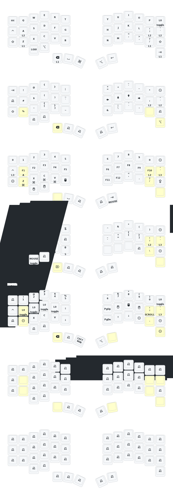

This keeb created by a group of people who loves keyball.

Special Thanks to: <br>
PCB: *[yangxing844](https://github.com/yangxing844)* <br>
Case: *[delock](https://github.com/delock)* <br>
Firmware: *[Amos698](https://github.com/Amos698)* <br>



## Features

### Runtime Automouse Timeout Adjustment

This configuration includes a custom ZMK behavior that allows you to adjust the automouse layer timeout at runtime without recompiling firmware. The automouse feature automatically activates a mouse layer when trackball movement is detected.

**Quick Start:**

Use the `&amto` behavior in your keymap:

```c
// Set timeout to 1 second
&amto 1000

// Increase timeout by 100ms
&amto (-2)

// Decrease timeout by 100ms
&amto (-1)

// Reset to default
&amto (-3)
```

**Example bindings** are included in the mouse layer:
- Bottom-left key: Sets timeout to 1000ms
- Second key: Increases timeout
- Third key: Decreases timeout

**Documentation:**
- Full documentation: [config/AUTOMOUSE_TIMEOUT_BEHAVIOR.md](config/AUTOMOUSE_TIMEOUT_BEHAVIOR.md)
- Usage examples: [config/automouse_timeout_examples.keymap](config/automouse_timeout_examples.keymap)

**Requirements:**
- PMW3610 trackball driver with automouse support
- `automouse-layer` configured in device tree (already set to layer 4)
