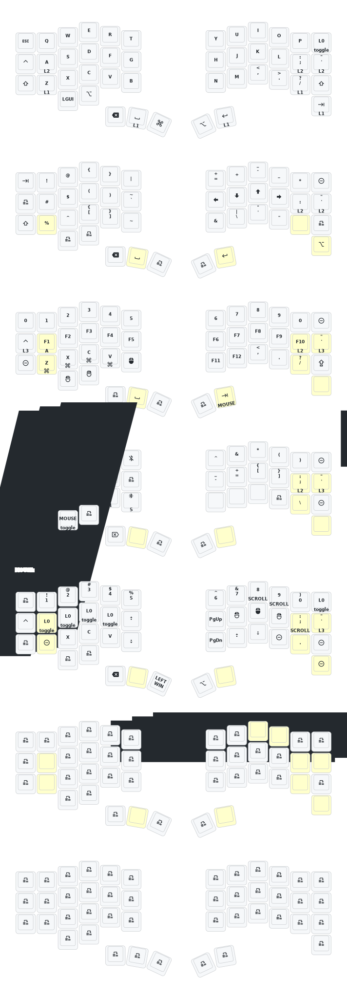

This keeb created by a group of people who loves keyball.

Special Thanks to:  
PCB: *[yangxing844](https://github.com/yangxing844)*  
Case: *[delock](https://github.com/delock)*  
Firmware: *[Amos698](https://github.com/Amos698)*  

## ✨ Features

### Runtime Auto Mouse Timeout Control

This configuration includes runtime control for the PMW3610 trackball's auto mouse layer timeout. Change how long the mouse layer stays active without rebuilding firmware!

**Quick Access:** Layer 3 → Right side, row 3
- Press 1st key: 1 second timeout ⏱️
- Press 2nd key: 2 seconds timeout ⏱️ (default)
- Press 3rd key: 5 seconds timeout ⏱️

📖 **Documentation:**
- [Quick Reference](QUICK_REFERENCE_TIMEOUT.md) - How to use the feature
- [Full Documentation](AUTOMOUSE_TIMEOUT_FEATURE.md) - Technical details and customization
- [Implementation Details](config/boards/shields/keyball_nano/AUTO_MOUSE_TIMEOUT_README.md) - For developers

**Based on:** [zmk-pmw3610-driver PR #2](https://github.com/dangnm/zmk-pmw3610-driver/pull/2) by [@dangnm](https://github.com/dangnm)
